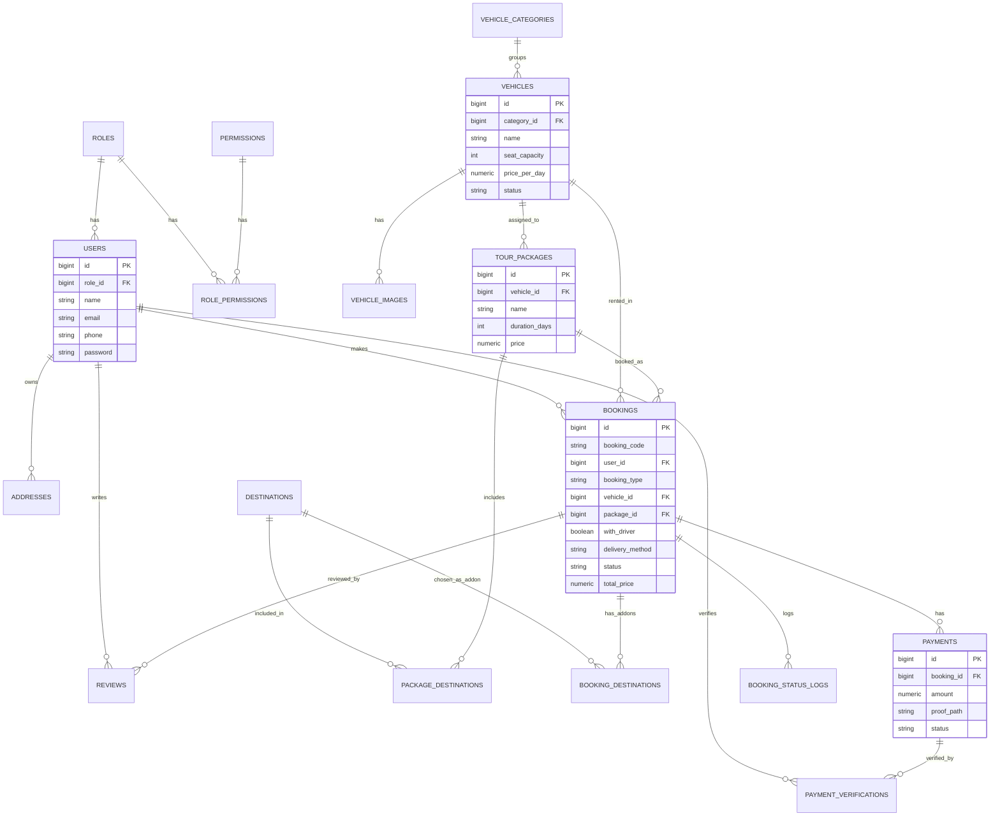

# Rancangan Database — We Rent Car
**Target:** PostgreSQL 15+
**Konvensi:** primary key `id BIGSERIAL`, snake_case, soft delete (`deleted_at`) pada tabel master penting, `timestamps` (`created_at`, `updated_at`) di semua tabel.

---

## 1. Entity Relationship Diagram (ringkas)

> Catatan: diagram di atas disederhanakan (tidak semua kolom ditampilkan). Skema lengkap ada di §2 dan `schema-postgres.sql`.

---

## 2. Deskripsi Tabel

### 2.1 `roles`
Daftar peran: `admin`, `staff`, `customer`. Menentukan area redirect setelah login.

### 2.2 `permissions`
Daftar aksi granular per modul, mis. `bookings.update_status`, `vehicles.delete`, `reports.view`. Dipakai untuk membatasi aksi staff tanpa mengubah kode.

### 2.3 `role_permissions`
Pivot `role_id` ↔ `permission_id`. Admin otomatis punya semua permission (bisa di-seed penuh); staff hanya subset sesuai matriks PRD §5.

### 2.4 `users`
Menyimpan admin, staff, dan customer dalam satu tabel dengan `role_id`. Field tambahan: `phone`, `avatar_path`, `status` (`active`/`inactive`, untuk nonaktifkan staff/customer tanpa hapus data), `email_verified_at`.

### 2.5 `addresses`
Alamat tersimpan milik customer (opsional, memudahkan booking berikutnya tanpa isi ulang) — juga dipakai sebagai sumber alamat penjemputan/pengantaran saat booking (`address_id` nullable di `bookings`, atau isi manual per booking via kolom snapshot — lihat §2.9).

### 2.6 `vehicle_categories`
Kategori mobil: City Car, MPV, SUV, Minibus, dll. Dipakai untuk filter katalog & penentuan kapasitas paket wisata.

### 2.7 `vehicles`
Data master mobil. `status` merepresentasikan kondisi umum (`tersedia`, `perawatan`, `nonaktif`) — ketersediaan riil per tanggal dihitung dari tabel `bookings` yang aktif (booking dengan status `dikonfirmasi`/`berlangsung` yang overlap tanggal).

### 2.8 `vehicle_images`
Galeri foto per mobil (relasi one-to-many), dengan `is_primary` untuk foto sampul di katalog.

### 2.9 `destinations`
Destinasi wisata Batam (Pantai Sekilak, Piayu Laut Seafood, dll.), dengan `addon_price` — biaya tambahan bila dipilih sebagai add-on saat booking mobil dengan supir.

### 2.10 `tour_packages`
Paket wisata siap pakai: kapasitas kursi, `vehicle_id` (mobil yang ditautkan sebagai representasi paket — admin bisa assign mobil aktual saat verifikasi bila mobil representatif sedang dipakai paket lain), `duration_days`, `price`, `driver_included` (selalu `true` secara bisnis, disimpan eksplisit untuk kejelasan).

### 2.11 `package_destinations`
Pivot many-to-many `tour_packages` ↔ `destinations`, dengan `order` (urutan itinerary).

### 2.12 `bookings`
Tabel inti. Satu baris = satu transaksi sewa, baik jenis `mobil` maupun `paket_wisata`.

Kolom kunci:
- `booking_type`: `mobil` | `paket_wisata`
- `vehicle_id`: wajib diisi untuk `mobil`; untuk `paket_wisata` diisi otomatis dari `tour_packages.vehicle_id` saat booking dibuat (snapshot).
- `package_id`: hanya diisi bila `booking_type = paket_wisata`.
- `with_driver`: `true` untuk semua booking `paket_wisata`; untuk `mobil` mengikuti pilihan pelanggan.
- `delivery_method`: `pickup_at_office` | `delivered_to_address` | `driver_pickup` — berlaku beda makna tergantung `with_driver`:
  - `with_driver = false` → hanya `pickup_at_office` atau `delivered_to_address` yang valid.
  - `with_driver = true` → selalu `driver_pickup` (supir jemput ke alamat pelanggan).
- `pickup_address_snapshot` (JSON/text): salinan alamat pada saat booking dibuat, agar histori tidak berubah walau `addresses` diedit kemudian.
- `start_datetime`, `end_datetime`: rentang sewa.
- `base_price`, `driver_fee`, `delivery_fee`, `addon_total`, `discount`, `total_price`: rincian biaya (dihitung & disimpan saat submit, bukan dihitung ulang on-the-fly, agar histori harga tidak berubah bila harga master berubah kemudian).
- `status`: `menunggu_pembayaran`, `menunggu_verifikasi`, `dikonfirmasi`, `berlangsung`, `selesai`, `ditolak`, `dibatalkan`.
- `notes`: catatan pelanggan.
- `internal_notes`: catatan staff/admin (tidak tampil ke pelanggan).

### 2.13 `booking_destinations`
Pivot add-on destinasi wisata untuk booking `mobil` dengan supir (bukan untuk `paket_wisata`, karena destinasi paket sudah ada di `package_destinations`). Simpan `price_at_booking` (snapshot harga add-on).

### 2.14 `payments`
Setiap upaya pembayaran (bisa lebih dari satu per booking bila bukti pertama ditolak). Field: `amount`, `bank_sender_name` (opsional, nama pengirim transfer), `proof_path` (path file, disimpan di storage privat), `status` (`menunggu`, `terverifikasi`, `ditolak`), `paid_at`.

### 2.15 `payment_verifications`
Log setiap tindakan verifikasi/penolakan: siapa (`verified_by` → `users.id`), kapan, `action` (`verify`/`reject`), `reason` (wajib diisi bila reject).

### 2.16 `booking_status_logs`
Audit trail perubahan status booking: `booking_id`, `from_status`, `to_status`, `changed_by`, `note`, `created_at`. Berguna untuk laporan & penelusuran sengketa.

### 2.17 `reviews`
Ulasan pelanggan pasca booking `selesai`. Terhubung ke `booking_id` (untuk validasi keaslian) sekaligus `vehicle_id`/`package_id` (nullable salah satu, sesuai jenis booking) agar mudah ditampilkan di halaman katalog. Field: `rating` (1–5), `comment`, `is_hidden` (moderasi admin).

### 2.18 `settings`
Key-value pengaturan sistem: info rekening bank tujuan transfer, kontak WhatsApp, konten homepage (hero text, dll.), kebijakan pembatalan.

---

## 3. Aturan Bisnis Penting yang Tercermin di Skema

1. **Anti double-booking**: sebelum insert booking baru untuk `vehicle_id` tertentu, aplikasi wajib cek tidak ada booking lain (status `dikonfirmasi`/`berlangsung`/`menunggu_verifikasi`) yang rentang `start_datetime`–`end_datetime`-nya overlap. Ditegakkan di level aplikasi (Laravel) + didukung index pada `(vehicle_id, start_datetime, end_datetime)`.
2. **Snapshot harga**: semua kolom harga di `bookings`, `booking_destinations`, dan `payments` menyimpan nilai final saat transaksi terjadi — bukan referensi live ke tabel master — agar histori transaksi tidak berubah bila admin mengubah harga di kemudian hari.
3. **Snapshot alamat**: `pickup_address_snapshot` di `bookings` mengunci data alamat pada saat booking, terpisah dari `addresses` (yang bisa terus diedit pelanggan untuk booking berikutnya).
4. **Validasi ulasan asli**: `reviews.booking_id` wajib merujuk booking milik `user_id` yang sama dan berstatus `selesai` (constraint di level aplikasi, didukung foreign key).
5. **RBAC granular**: penambahan/pengurangan hak staff cukup lewat tabel `role_permissions`, tanpa deploy ulang kode.

---

## 4. Indeks yang Direkomendasikan
- `bookings (vehicle_id, start_datetime, end_datetime)` — cek ketersediaan cepat.
- `bookings (user_id, status)` — riwayat & filter dashboard pelanggan.
- `bookings (status, created_at)` — antrian admin.
- `payments (booking_id, status)`.
- `vehicles (category_id, status)`.
- `reviews (vehicle_id)`, `reviews (package_id)`.

Skema DDL lengkap (tipe data, constraint, default, index) ada di file terpisah **`schema-postgres.sql`** agar bisa langsung dijalankan (`psql -f schema-postgres.sql`) atau dijadikan acuan migration Laravel.
